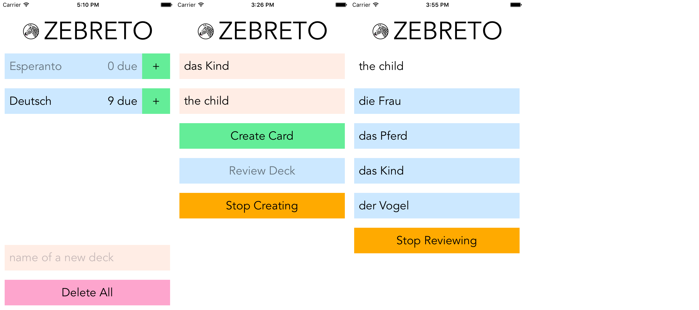
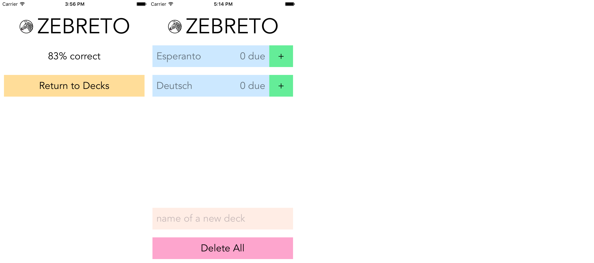

# Putting It All Together

> Now that we’ve covered many of the pieces you’ll need to build your own React Native applications, let’s put everything together. Up until now, we’ve mostly dealt with small examples. In this chapter we’ll look at the structure of a larger application.

Quotes in this file are from various sources:

* *Learning React Native* by Bonnie Eisenman
* [Redux](https://github.com/reactjs/redux)
* [Redux Thunk](https://github.com/gaearon/redux-thunk)
* [Encapsulating the Redux State Tree](http://randycoulman.com//blog/2016/09/13/encapsulating-the-redux-state-tree/)
* [React](https://facebook.github.io/react/index.html)

## Zebreto

> Zebreto is a flashcard application based on the Spaced Repetition System. The goal is to review information just before you would otherwise forget it. A common approach is to start with a small interval between reviews, such as an hour, and to slowly scale up as you get cards correct. Tracking these intervals is impractical with pencil-and-paper flashcards, so we’ll build an application instead.

Pictures in this file show Zebreto running on an iPhone 7 simulator.

Zebreto has screens for decks, card creation, and card review:



### Creating a new deck and cards

1. On the decks screen, tap the tan input box that displays **name of a new deck** as a placeholder, enter a deck name, and then tap **return**.
2. On the card creation screen, tap the first tan input box that displays **front of a new card** as a placeholder, enter the front, and then tap **return**.
3. Tap the second tan input box that displays **back of a new card** as a placeholder, enter the back, and then tap **return**.
4. Tap **Create Card**.
5. Do one of the following:
    * To create another card, go to step 2.
    * To review the new cards, tap **Review Deck**.
    * To return to the decks screen, tap **Stop Creating**.


### Reviewing cards

1. On the decks screen, tap a blue deck button if it displays a non-zero number of cards due for review.
2. On the card review screen, look at the word or phrase at the top, and then tap the blue button that displays the correct meaning.
3. See the correct answer, and then tap **Continue**.
4. Do one of the following:
    * To answer the next review question that appears, go to step 2.
    * To stop before you have finished reviewing the deck, tap **Stop Reviewing**.
    * When the percent correct appears because you have finished reviewing the deck, tap **Return to Decks**.




### Project

The code is in the `Zebreto` directory of the `learning-react-native` project on GitHub.

* The original code as described in chapter 9 of the book:

    [https://github.com/bonniee/learning-react-native/tree/master/Zebreto](https://github.com/bonniee/learning-react-native/tree/master/Zebreto)

* The code in this branch has changes to the interaction, interface, and data flow:

    [https://github.com/pedrottimark/learning-react-native/tree/zebreto-redux/Zebreto](https://github.com/pedrottimark/learning-react-native/tree/zebreto-redux/Zebreto)

Example code in this file is often oversimplified. For more information, see the `learning-react-native/Zebreto/src` directory:

* `components/**/*.js`
* `data/*.js`
* `reducers/*.js`
* `styles/*.js`
* `actions.js`
* `scenes.js`

### ECMAScript

The code includes several features of ECMAScript 2015, also known as ES6:

* arrow functions
* computed property names
* `const` or `let` instead of `var` declarations
* destructuring
* modules: `import` and `export`
* object property initializer shorthand
* spread operator

It also includes two proposed features for a future ECMAScript version:

* class static fields
* class instance fields: for more information, see [React Binding Patterns](https://medium.com/@housecor/react-binding-patterns-5-approaches-for-handling-this-92c651b5af56#f45f)

## Data

Zebreto organizes data as *modules* which export *functions* instead of classes which define methods. A deck or a card is a plain object. The decks and the cards are arrays.

### Decks

Here are the properties of a deck:

* `name` is entered by a person
* `id` is generated by Zebreto using the `md5` package

Here is the relevant code in `src/data/decks.js`:

```js
import md5 from 'md5';

// Return a deck object.
export const deckObject = (name) => ({
  name,
  id: md5(name),
});

// Initial state of the decks:
// before they have been read from storage
// or when Zebreto runs the first time.
export const decksInitial = [];

// Return the new state of the decks when a deck is added.
export const addDeck = (decks, deck) =>
  decks.concat(deck);
```

### Cards

Here are the properties of a card:

* `front` and `back` of a card are entered by a person: a word or phrase in one language and a short definition in another language
* `deckID` is associated with the card by Zebreto
* `strength` is initialized to zero by Zebreto
* `dueDate` to review the card is initialized to a string in ISO 8601 format by Zebreto, which assumes that `date` was generated using the `moment` package
* `id` is generated by Zebreto using the `md5` package

Here is the relevant code in `src/data/cards.js`:

```js
import md5 from 'md5';

// Return a card object.
export const cardObject = (front, back, deckID, date) => ({
  front,
  back,
  deckID,
  strength: 0,
  dueDate: date.toISOString(),
  id: md5(front + back + deckID),
});

// Initial state of the cards:
// before they have been read from storage
// or when Zebreto runs the first time.
export const cardsInitial = [];

// Return the new state of the cards when a card is added.
export const addCard = (cards, card) =>
  cards.concat(card);
```

Here is example code to create a deck and a card:

```js
import moment from 'moment';

const deck_de_en = deckObject('Deutsch');
const decks = addDeck(decksInitial, deck_de_en);

const card = cardObject('das Kind', 'the child', deck_de_en.id, moment());
const cards = addCard(cardsInitial, card);
```

### Pure functions and immutable data

The functions in the previous section are known as *pure* functions:

* Always return the same output for the same input.
* Never depend on side-effects, including external API calls.
* Never cause side-effects, including changes to the value of an argument.

Soon you will see why this matters. For now, compare them to *impure* versions.

Here is a function that returns different values of `dueDate` because it depends on an external API call for the current time:

```js
export const cardObjectImpure = (front, back, deckID) => ({
  front,
  back,
  deckID,
  strength: 0,
  dueDate: moment().toISOString(), // impure
  id: md5(front + back + deckID),
});

const card1 = cardObjectImpure('das Kind', 'the child', deck_de_en.id);
const card2 = cardObjectImpure('das Kind', 'the child', deck_de_en.id);

console.log(card1.dueDate === card2.dueDate); // false
```

Here is a function that changes the value of the `cards` argument:

```js
export const addCardImpure = (cards, card) => {
  cards.push(card); // impure
};

const cards = cardsInitial;
console.log(cards.length); // 0
addCardImpure(cards, card);
console.log(cards.length); // 1
```

A change is also known as a *mutation*. The opposite of mutable data is *immutable* data.

* `addCardImpure` calls `push` to change (mutate) the previous state of `cards` into the new state.
* `addCard` calls `concat` to output the new state for the inputs: `cards` is the previous state, `card` is the change to the state.

Soon you will see why this matters. For now, if you worry about the cost of immutable data:

* When `concat` returns a new array, it does not make a copy of the elements (card objects) because they do not change.
* Garbage collection can reclaim memory space from obsolete previous states (cards arrays) when there is no reference to them.
* To reduce memory space for new arrays, you could use a library for [immutable collections](https://facebook.github.io/immutable-js/).

## Redux

Zebreto uses ~~Reflux~~ Redux for its data flow architecture.

> Redux is a predictable state container for JavaScript apps. Redux evolves the ideas of Flux, but avoids its complexity by taking cues from Elm.

>  Redux can be described in three fundamental principles:

> * **Single source of truth**: The state of your whole application is stored in an object tree within a single store.
* **State is read-only**: The only way to change the state is to dispatch an action, an object describing what happened.
* **Changes are made with pure functions:** To specify how the state tree is transformed by actions, you write pure reducers.

### Actions

> Instead of mutating the state directly, you specify the mutations you want to happen with plain objects called *actions*. They are the *only* source of information for the store. Actions must have a `type` property that indicates the type of action being performed.

An *action creator* is a function that returns a particular type of action.

Here is the relevant code in `src/actions.js` for three action creators related to cards and decks:

```js
export const receiveData = ({ cards, decks }) => ({
  type: 'RECEIVE_DATA',
  cards, // undefined when Zebreto runs the first time
  decks, // undefined when Zebreto runs the first time
});

const createCardSucceeded = (card) => ({
  type: 'CREATE_CARD_SUCCEEDED',
  card,
});

const createDeckSucceeded = (deck) => ({
  type: 'CREATE_DECK_SUCCEEDED',
  deck,
});
```

### Reducers

Now you will see why the `cards` and `decks` modules export pure functions.

> The reducer is a pure function that takes the previous state and an action, and returns the next state.

Zebreto uses the *reducer composition* pattern:

* The application state consists of four properties: `cards`, `decks`, `deckID`, `status`.
* The root reducer consists of corresponding child reducers.

> This is exactly like there is just one root component in a React app, but it is composed out of many small components.

Here is the relevant code in `src/reducers/cards.js` for the actions in the previous section:

```js
import {
  addCard,
  cardsInitial,
} from './../data/cards';

export default function (cards = cardsInitial, action) {
  switch (action.type) {

  // Update from storage after Zebreto starts, unless this is the first time.
  case 'RECEIVE_DATA':
    return action.cards || cards;

  case 'CREATE_CARD_SUCCEEDED':
    return addCard(cards, action.card);

  default:
    return cards;

  }
}
```

Here is the relevant code in `src/reducers/decks.js`:

```js
import {
  addDeck,
  decksInitial,
} from './../data/decks';

export default function (decks = decksInitial, action) {
  switch (action.type) {

  // Update from storage after Zebreto starts, unless this is the first time.
  case 'RECEIVE_DATA':
    return action.decks || decks;

  case 'CREATE_DECK_SUCCEEDED':
    return addDeck(decks, action.deck);

  default:
    return decks;

  }
}
```

Here is the relevant code in `src/reducers/deckID.js`:

```js
import {
  deckIDInitial,
} from './../data/decks';

export default function (deckID = deckIDInitial, action) {
  switch (action.type) {

  case 'CREATE_DECK_SUCCEEDED': // let a person start creating cards in a new deck
    return action.deck.id;

  default:
    return deckID;

  }
}
```

Here is the relevant code in `src/reducers/status.js`:

```js
const statusInitial = '';

export default function (status = statusInitial, action) {
  switch (action.type) {

  case 'CREATE_CARD_SUCCEEDED':
  case 'CREATE_DECK_SUCCEEDED': // let a person start creating cards in a new deck
    return 'CREATING_CARDS';

  default:
    return status;

  }
}
```

> Redux provides a utility to generate a function that calls your reducers with the slices of state selected according to their keys, and combine their results into a single object again.

Here is the code in `/src/reducers/index.js`:

```js
import { combineReducers } from 'redux';

// child reducers
import cards from './cards';
import decks from './decks';
import deckID from './deckID';
import status from './status';

// root reducer
export default combineReducers({
  cards,
  decks,
  deckID,
  status,
});
```

### Store

> In the previous sections, we defined the actions that represent the facts about “what happened” and the reducers that update the state according to those actions. The *store* is the object that brings them together. It's easy to create a store if you have a reducer.

Here are the relevant code in `/src/components/Zebreto.js`:

```js
import { createStore } from 'redux';
import reducer from './../reducers';

const store = createStore(reducer);
```

Redux has *unidirectional* data flow:

1. A React component dispatches an action: `store.dispatch(action)`.
2. The store calls its reducer function: given the previous state and the action, it returns the next state.
3. The store calls any listener functions that have been registered with `store.subscribe(listener)`. A listener can call `store.getState()` to get the application state.

After the `Zebreto` component mounts, it calls `readData` to read data from storage asynchronously, and then the callback function dispatches an action. In the previous sections, you saw some relevant code:

* `receiveData` action creator
* `case 'RECEIVE_DATA':` in `cards` and `decks` reducers

Here is the relevant code in `/src/components/Zebreto.js`:

```js
import { createStore } from 'redux';
import { receiveData } from './../actions';
import { readData } from './../data/storage';
import reducer from './../reducers';

const store = createStore(reducer);

class Zebreto extends Component {
  componentDidMount() {
    // Placeholder for code to write cards or decks whenever they have changes.

    // Read cards and decks from storage asynchronously, and then dispatch an action.
    readData((data) => {
      store.dispatch(receiveData(data));
    });
  }
}
```

After the `Zebreto` component mounts, it subscribes a listener function to write data whenever the `cards` or `decks` property of application state has changed. When the component will unmount, it unsubscribes the listener function.

Here are the relevant code in `/src/components/Zebreto.js`:

```js
import { createStore } from 'redux';
import { receiveData } from './../actions';
import { readData, writeCards, writeDecks } from './../data/storage';
import reducer from './../reducers';

const store = createStore(reducer);

class Zebreto extends Component {
  componentDidMount() {
    // Write cards or decks whenever they have changes.
    let { cards: cardsPrev, decks: decksPrev } = store.getState();
    this.unsubscribe = store.subscribe(() => {
      const { cards, decks } = store.getState();

      // Can test for changes by strict inequality because state is immutable :)
      if (cardsPrev !== cards) {
        writeCards(cards); // asynchronous
        cardsPrev = cards;
      }
      if (decksPrev !== decks) {
        writeDecks(decks); // asynchronous
        decksPrev = decks;
      }
    });

    // Read cards and decks from storage asynchronously, and then dispatch an action.
    readData((data) => {
      store.dispatch(receiveData(data));
    });
  }

  componentWillUnmount() {
    this.unsubscribe();
  }
}
```

Now you see a benefit of immutable application state in Redux. To test for changes, the listener compares properties of current state to previous state with the `!==` strict inequality operator.

Zebreto applies a principle known as *tight* cohesion and *loose* coupling:

* The `cards` and `decks` reducers encapsulate state changes.
* The `storage` module encapsulates data persistence. It uses `AsyncStorage` in React Native, but using something else (for example, a SQLite database or a remote server) would not affect any of the *calls* to its three exported functions: `readData`, `writeCards`, `writeDecks`.
* The coupling between state and storage is loose, *only* in `componentDidMount`, via actions and listeners.

In contrast, because mutable data has only a current state, the cohesion would be looser and the coupling would be tighter: in *every* place where the state of cards or decks changes, the code would *also* have to call a function to write the changes to storage.

### Thunks

What does Zebreto do with an action to create a deck, if a deck with that name already exists?

In previous sections about actions and reducers, you saw the `'CREATE_DECK_SUCCEEDED'` action type. Thank you for waiting patiently to see its counterpart, the `'CREATE_DECK_FAILED'` action type.

> A thunk can be used to dispatch actions only if a certain condition is met. The inner function receives the store methods `dispatch` and `getState` as parameters.

The `DeckCreation` component calls the `createDeck` action creator. The component doesn’t know (or need to know) that the action creator returns a thunk function instead of an action object. The thunk determines from the current state which action object to dispatch.

Here is the relevant code in `src/actions.js`:

```js
import {
  deckExists,
  deckObject,
} from './data/decks';

const createDeckFailed = () => ({
  type: 'CREATE_DECK_FAILED',
});

const createDeckSucceeded = (deck) => ({
  type: 'CREATE_DECK_SUCCEEDED',
  deck,
});

export const createDeck = (name) => (dispatch, getState) =>
  dispatch(deckExists(getState().decks, name)
    ? createDeckFailed()
    : createDeckSucceeded(deckObject(name))
  );
```

Here is the relevant code in `src/reducers/status.js`:

```js
export default function (status = statusInitial, action) {
  switch (action.type) {

  case 'CREATE_DECK_FAILED':
    return 'CREATING_DECK_FAILED';

  case 'CREATE_DECK_SUCCEEDED': // let a person start creating cards in a new deck
    return 'CREATING_CARDS';

  default:
    return status;

  }
}
```

Soon you will see how Zebreto displays a message if a deck with that name already exists:


The `createCard` action creator also returns a thunk, because a card with that front and back might already exist in the deck.


### Middleware

> Redux middleware provides a third-party extension point between dispatching an action, and the moment it reaches the reducer. Redux Thunk middleware allows you to write action creators that return a function instead of an action.

Here is the relevant code in `src/components/Zebreto.js` to extend a Redux store with Redux Thunk middleware:

```js
import { createStore, applyMiddleware } from 'redux';
import thunk from 'redux-thunk';

const store = createStore(reducer, applyMiddleware(thunk));
```

### Provider and connect

In a previous section, you saw the `componentDidMount` method refer to the store directly, because the store is defined in the same module as the `Zebreto` component. How do descendent components refer to the store?

> React bindings for Redux embrace the idea of separating presentational and container components.

In Zebreto, *container* components render scenes. The `src/components` directory has a subdirectory for each scene:

* `Decks` to start activities with decks
* `NewCard` to create cards in a deck
* `Review` to review cards that are due in a deck

> Use a special React Redux component called `Provider` to magically make the store available to all container components in the application without passing it explicitly.

Here is the relevant code in `src/components/Zebreto.js`:

```js
import { Provider } from 'react-redux';

import { createStore, applyMiddleware } from 'redux';
import thunk from 'redux-thunk';

const store = createStore(reducer, applyMiddleware(thunk));

class Zebreto extends Component {}

export default () => (
  <Provider store={store}>
    <Zebreto/>
  </Provider>
);
```

The `connect` function returns a new connected component class for a given container component class and mappings:

* `mapStateToProps` is called whenever the application state changes: given some properties of the state, it returns a plain object whose properties will be merged into the `props` of the container component.
* `mapDispatchToProps` is called when the component is connected to the Redux store: given some action creators, it returns *bound* action creators which are merged into the `props` of the container component. That is, bound to the store so they automatically dispatch action objects or thunk functions.

The `Decks` component provides `status` from application state and a bound `createDeck` action creator as props when it renders the `DeckCreation` component.

Here is the relevant code in `src/components/Decks/index.js`:

```js
import { connect } from 'react-redux';

import { createDeck } from './../../actions';

class Decks extends Component {
  render() {
    return (
      <View>
        <DeckCreation createDeck={this.props.createDeck} status={this.props.status}/>
      </View>
    );
  }
}

const mapStateToProps = ({ status }) => ({
  status,
});
const mapDispatchToProps = {
  createDeck,
};

export default connect(mapStateToProps, mapDispatchToProps)(Decks);
```

Here is the relevant code in `src/components/Decks/DeckCreation.js` for the `createDeck` prop:

```js
export default class DeckCreation extends Component {
  _onEntry = (name) => {
    this.props.createDeck(name);
  }

  render() {
    return (
      <Input placeholder='name of a new deck' onEntry={this._onEntry}/>
    );
  }
}
```

### Component state, part 1

> To implement interactions, we introduce mutable state to the component. `this.state` is private to the component and can be changed by calling `this.setState()`. When the state updates, the component re-renders itself.

The `render` method of `DeckCreation` depends on:

* `status` from *application* state: whether a deck with that name already exists
* `continuing` from *component* state: whether a person clicked to acknowledge a message

Here is the relevant code in `src/components/Decks/DeckCreation.js`:

```js
export default class DeckCreation extends Component {
  constructor(props) {
    super(props);
    this.state = {
      continuing: false,
    };
  }

  _continue = () => {
    this.setState({
      continuing: true,
    });
  }

  _onEntry = (name) => {
    this.props.createDeck(name);
  }

  render() {
    return this.props.status === 'CREATING_DECK_FAILED' && !this.state.continuing
      ? (
          <MessageButton onPress={this._continue}>
            <NormalText>Deck already exists</NormalText>
            <NormalText>Continue</NormalText>
          </MessageButton>
        )
      : (
          <Input placeholder='name of a new deck' onEntry={this._onEntry}/>
        );
  }
}
```

### Selectors

Each scene depends on the cards due for review:

* decks: each deck button displays the number of cards due and it is disabled if zero cards are due
* card creation: the **Review Deck** button is disabled if no cards are due
* card review: the questions are for the cards that are due

This is known as *derived* data, because it is computed from:

* the `cards` and `deckID` properties of application state
* the current time

> A selector is a function that takes the state and optional additional parameters and returns some data.

> Whenever possible, compute values on-the-fly to ensure that they don't get out of sync.

In a previous section, you saw `mapStateToProps` merge properties of application state into the `props` of a container component whenever they change. It can also merge derived data returned from a selector.

Here is the relevant code in `src/components/NewCard/index.js`:

```js
import { connect } from 'react-redux';

import moment from 'moment';

import { reviewDeck } from './../../actions';
import { someCardDueForReview } from './../../data/cards';

class NewCard extends Component {
  _reviewDeck = () => {
    this.props.reviewDeck(this.props.deckID);
  }

  // The button is disabled when no cards are due for review.
  _reviewDisabled() {
    return this.props.noCardsDue;
  }

  render() {
    return (
      <View>
        <Button onPress={this._reviewDeck} disabled={this._reviewDisabled()}>
          <InterfaceText>Review Deck</InterfaceText>
        </Button>
      </View>
    );
  }
}

const mapStateToProps = ({ cards, deckID }) => ({
  deckID,
  noCardsDue: !someCardDueForReview(cards, deckID, moment()),
});
const mapDispatchToProps = {
  reviewDeck,
};

export default connect(mapStateToProps, mapDispatchToProps)(NewCard);
```

### Component state, part 2

The relationship between application state and the component state of `Review` is more complex, because reviewing is more complex.

Creating questions and answers has several steps, including *impure* steps:

* The subset of cards that are due for review in the current deck depends on the *current time*.
* The questions for the subset or cards are *ordered randomly*. Two questions per card: front and back.
* The answers for each question are *ordered randomly*.
* The incorrect answers for each question are *selected randomly* from the other cards in the deck.

The time to dispatch an action to update a reviewed card is when a person answers its *second* question. The strength of a card increases if *both* answers are correct. Therefore, reviewing needs temporary state for questions that have been answered less than two times.

Here is a clear *separation* of concerns:

* `cards` and `deckID` are from *application* state
* whatever will become obsolete at the end of a review is in *component* state

Here is the relevant code in `src/components/Review/index.js`:

```js
import { connect } from 'react-redux';

import moment from 'moment';

import {
  stopReviewing,
  updateCard,
} from './../../actions';
import {
  cardResultAnswered,
  getInitialStateReviewing,
  progressAnswered,
} from './../../data/reviewing';

class Review extends Component {
  constructor(props) {
    super(props);

    // Props in getInitialState is an anti-pattern. However, it's not an anti-pattern
    // if the prop is only seed data for internally-controlled state of the component.
    const { cards, deckID } = this.props;
    const { cardQuestions, progress } = getInitialStateReviewing(cards, deckID, moment()); // impure

    this._cardQuestions = cardQuestions; // internal data that does not change
    this.state = {
      progress, // internal data that does change
      feedback: this._feedbackUnanswered(), // external interface that does change
    };
  }

  // Show the next question (or the percent answered correctly at the end).
  _feedbackUnanswered() {
    return {
      showingAnswer: false,
      correctlyAnswered: true,
    };
  }

  // Show feedback for an answer to a question.
  _feedbackAnswered(correctlyAnswered) {
    return {
      showingAnswer: true,
      correctlyAnswered,
    };
  }

  _answerQuestion = (correct) => {
    // Update application state when the last question for a card is answered.
    // cardResult is the part of component state that directly affects application state.
    // setState changes the cardResults in the progress property of component state.
    const cardResult = cardResultAnswered(this.state.progress, this._cardQuestions, correct);
    if (cardResult.nUnanswered === 0) {
      this.props.updateCard(cardResult.cardID, cardResult.correct);
    }

    // Update component state and show feedback for every answer.
    this.setState(({ progress }) => ({
      progress: progressAnswered(progress, this._cardQuestions, correct),
      feedback: this._feedbackAnswered(correct),
    }));
  }

  // Click to acknowledge the feedback.
  _continueReviewing = () => {
    this.setState({
      feedback: this._feedbackUnanswered(),
    });
  }

  render() {
    // child component props include:
    // answerQuestion={this._answerQuestion}
    // continueReviewing={this._continueReviewing}
    // stopReviewing={this.props.stopReviewing}
  }
}

const mapStateToProps = ({ cards, deckID }) => ({
  cards,
  deckID,
});
const mapDispatchToProps = {
  stopReviewing,
  updateCard,
};

export default connect(mapStateToProps, mapDispatchToProps)(Review);
```

The `reviewing` module applies the “Learn Once, Write Anywhere” principle of React:

* `getInitialStateReviewing` encapsulates the impure steps to return properties of the initial component state, just as an *action creator* can encapsulate impure steps to create an action object to change application state.
* `progressAnswered` returns a property of the next component state, just as a child *reducer* returns a property of the next application state.
* `cardResultAnswered` is a *selector* function that computes derived data from component state, just as `someCardDueForReview` computes derived data from application state.

## React Native

### Navigator

> * You can use navigators to transition between multiple screens.
* A scene is nothing other than a React component that is typically rendered full screen.
* A route is an object that provides all the context that the navigator's renderScene function needs to render a scene.

Routing in Zebreto depends on application state:

* The `status` property determines which scene component to render. Therefore, changes to the navigation stack depend on *declarative* logic instead of *imperative* commands.
* As you saw in a previous section, each scene component accesses application state via a `mapStateToProps` function. Therefore, a route has only a `component` property. It does not need to provide any additional parameters.

Here is the relevant code in `/src/components/Zebreto.js` to render scenes:

```js
import React, { Component, createElement } from 'react';

import { createStore, applyMiddleware } from 'redux';
import thunk from 'redux-thunk';

import reducer from './../reducers';
import componentForState from './../scenes';

const store = createStore(reducer, applyMiddleware(thunk));

class Zebreto extends Component {
  constructor(props) {
    super(props);
    this._componentInitial = componentForState(store.getState());
  }

  render() {
    return (
      <View>
        <Header/>
        <Navigator
          ref={(navigator) => {
            this._navigator = navigator;
          }}
          initialRoute={{ component: this._componentInitial }}
          renderScene={({ component }) => createElement(component)}
        />
      </View>
    );
  }
}
```

In a previous section, you saw a listener write data whenever the `cards` or `decks` property of application state changes. A similar listener pushes to or pops from the navigation stack whenever the scene changes.

Here is the additional code in `/src/components/Zebreto.js` to change scenes:

```js
class Zebreto extends Component {
  componentDidMount() {
    // Cause navigator to render the scene whenever it changes.
    // Minimum Viable Router :)
    let componentPrev = this._componentInitial;
    this.unsubscribe = store.subscribe(() => {
      const component = componentForState(store.getState());

      // Can test for changes by strict inequality because component is a class :)
      if (componentPrev !== component) {
        if (this._componentInitial === component) {
          this._navigator.popToTop(); // Top = initialRoute of Navigator
        } else {
          this._navigator.push({ component });
        }
        componentPrev = component;
      }
    });
  }
}
```

Routing applies the principle known as *tight* cohesion and *loose* coupling:

* A reducer computes  `status` after a component dispatches an action.
* The `componentForState` function maps `status` to the component class of a scene.
* The listener calls the `push` and `popToTop` methods which cause `Navigator` to render the scene.

Here is the code in `/src/scenes.js`:

```js
// Minimum Viable Routes :)

import Decks from './components/Decks';
import NewCard from './components/NewCard';
import Review from './components/Review';

export default function ({ status }) {
  switch (status) {

  case 'CREATING_CARDS':
  case 'CREATING_CARD_FAILED':
    return NewCard;

  case 'REVIEWING_CARDS':
    return Review;

  default:
    return Decks;

  }
}
```

### Styles for responsive design

> The reusable text components in Zebreto scale the font size based on screen width in order to accommodate different device sizes.

Different font sizes on an iPhone 7 and iPhone 5:


Here is the code in `/src/styles/fonts.js`:

```js
import {
  Dimensions,
  StyleSheet,
} from 'react-native';

const { width } = Dimensions.get('window');

const headerSize = width / 7;
const normalSize = width / 15;

const lineHeight = 1.4;

export const headerHeight = headerSize * lineHeight;
export const normalHeight = normalSize * lineHeight; // for Input, see layout

export default StyleSheet.create({
  header: {
    fontFamily: 'Avenir Medium',
    fontSize: headerSize,
    lineHeight: headerHeight,
  },
  normal: {
    fontFamily: 'Avenir Medium',
    fontSize: normalSize,
    lineHeight: normalHeight,
  },
});
```

Here is the relevant code in `src/components/NormalText.js`:

```js
import fonts from './../styles/fonts';

// The component to display most of the text.
const NormalText = ({ children, style }) => (
  <Text style={[fonts.normal, style]}>
    {children}
  </Text>
);
```

Here is the relevant code in `/src/styles/layout.js`:

```js
import { normalHeight } from './fonts';

const margin = 10;
const padding = 10;

export default StyleSheet.create({
  // For leaf components that extend View, therefore have block layout.
  normal: {
    marginTop: margin,
    marginBottom: margin,
    padding,
    minHeight: normalHeight + 2 * padding, // for Input when it is empty
  },
});
```

Here is the relevant code in `src/components/Input.js`:

```js
import colors from './../styles/colors';
import fonts from './../styles/fonts';
import layout from './../styles/layout';

// The component to receive typed input.
export default class Input extends Component {
  render() {
    return (
      <TextInput style={[layout.normal, fonts.normal, colors.input, this.props.style]}/>
    );
  }
}
```

## Dependencies

The Zebreto application depends on the following packages:

* React: `react`, `react-native`
* Redux: `react-redux`, `redux`, `redux-thunk`
* utilities: `immutable`, `lodash`, `md5`, `moment`

The Zebreto project depends on the following packages for development only:

* Redux: `redux-logger`
* code quality and consistency: `babel-eslint`, `eslint`, `eslint-plugin-react`

## Summary and Homework

> The Zebreto application is meant to serve as a reference. In many ways, it’s a “minimum viable project,” and there are plenty of ways it could be improved.

> If you want to get some more practice working within the context of React Native, I encourage you to check out the GitHub repository and try extending Zebreto.

>Here are some ideas to get you started:
* Add the ability to delete decks
* Display statistics about the card strengths in a deck
* Change the `Decks` component to use a `ListView`

* The original code as described in chapter 9 of the book:

    [https://github.com/bonniee/learning-react-native/tree/master/Zebreto](https://github.com/bonniee/learning-react-native/tree/master/Zebreto)

* The code in this branch has changes to the interaction, interface, and data flow:

    [https://github.com/pedrottimark/learning-react-native/tree/zebreto-redux/Zebreto](https://github.com/pedrottimark/learning-react-native/tree/zebreto-redux/Zebreto)
